# Sales Data Analysis 

#### Introduction
This is an excel project on the employees’ data and sales data of a company. The aim is to analyze the data to gain insight into the employees’ details and also the revenue and profit of the company. 

**_Disclaimer_**: This project does not represent the interest of any company, institutions or country.

#### Problem Statement

- Which of the employees are freelancers?
-  What is the first name and last name of the employees?
-  What is the highest and lowest salary?
-  What is the total revenue and profit generated?
-  What is the average revenue and units sold for every order?
-  What is the total discount given in $?
-  What is the number of sales recorded?
-  What is the highest profit generated?
-  Create a column for Sales Range to determine if sales are high or low? 

#### Skills demonstrated

- Data filtering and manipulation
- Text to column
- Conditional formatting tool
- Use of basic formula and functions

#### Data Sourcing

This sales data was provided to me by my tutor to work with. The employees’ dataset is formed by myself to practise with.  

#### Data Transformation

The data was transformed with data in each column reformatted to the data type that fits their content. 

#### Analysis 

##### Which of the employees are freelancers? 

This was carried out using the filter button in Excel. And the following result was achieved. 

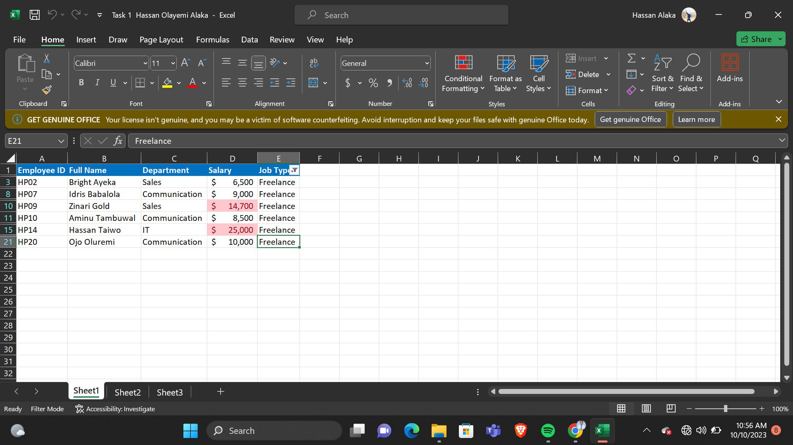

##### What is the first name and last name of the employees? 

This was carried out using the Text to Column option in Excel and the below result was achieved. 

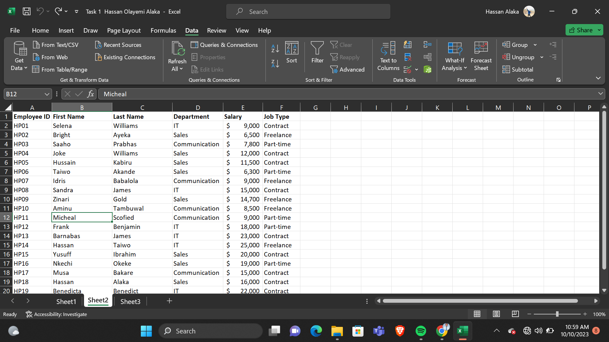

##### What is the highest and lowest salary? 

This was carried out using the conditional formatting tool with specific to Top 1 and Bottom 1 and the following result was achieved. 

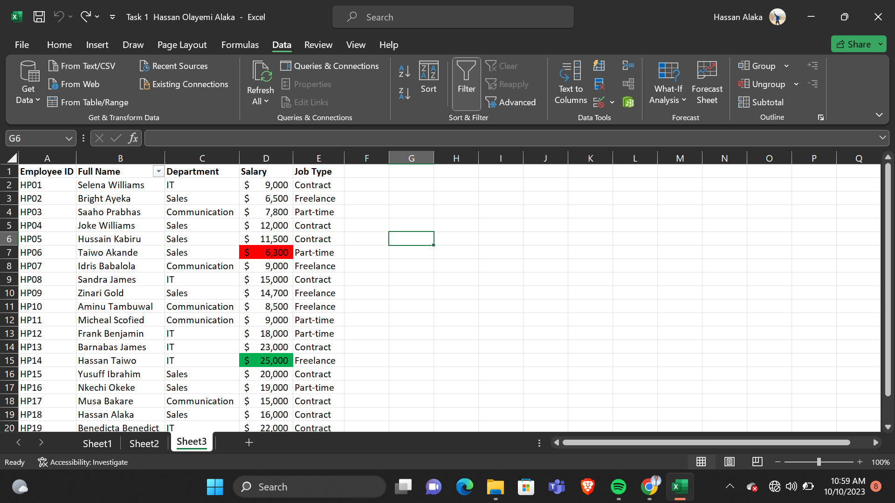

##### What is the total revenue and profit generated?

This was carried out using the SUM function in excel to calculate the total revenue and profit. The result is shown in the picture below. 

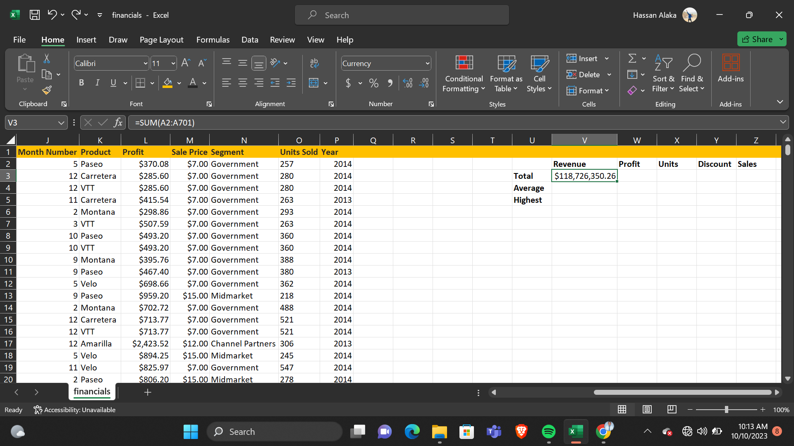
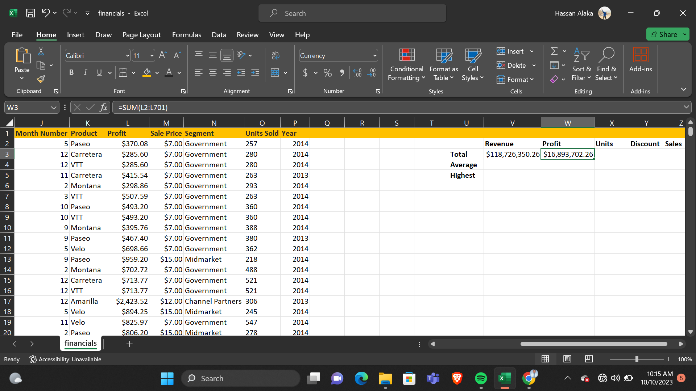

##### What is the average revenue and units sold for every order?

The average revenue and units sold was calculated using the AVERAGE function in Excel. The result is shown in the image below. 

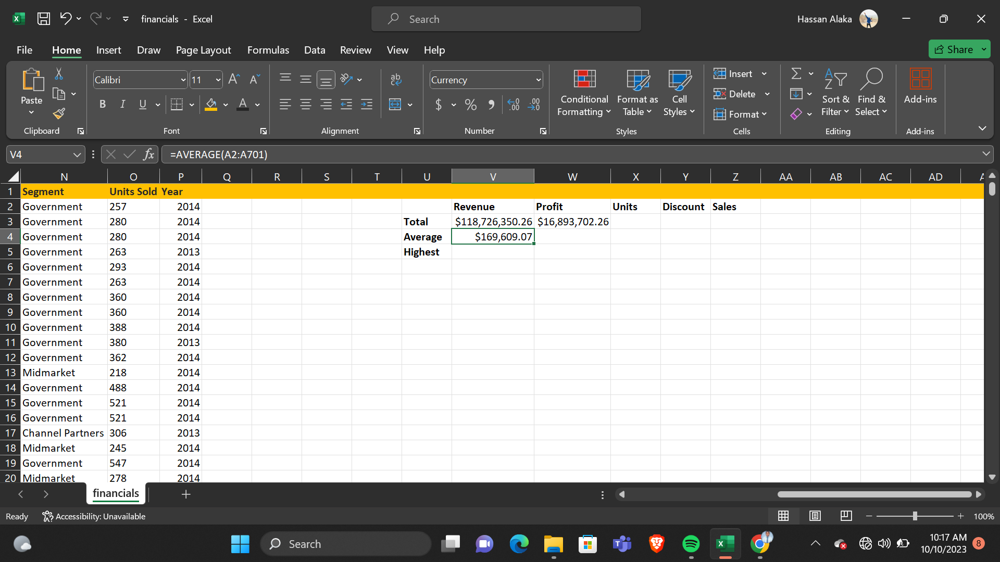
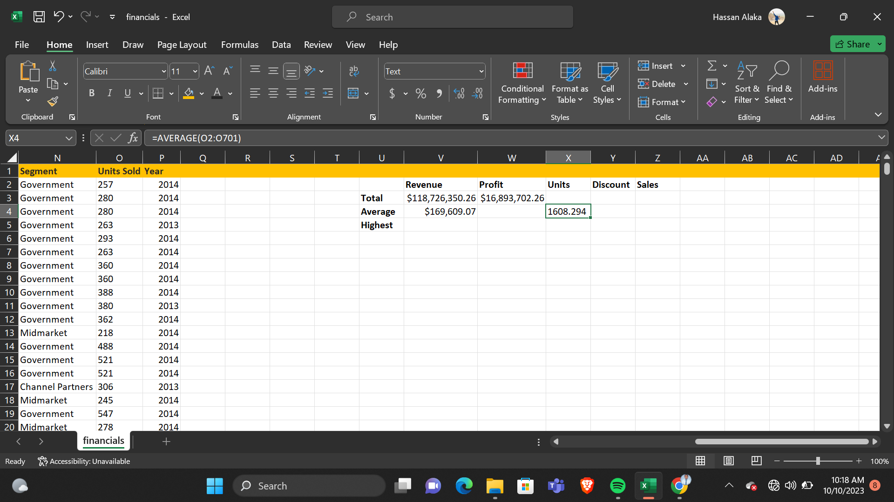

##### What is the total discount given in $?

The total discount was calculated using the SUM function and the result is $9,205,248.24. It is shown in the image below. 

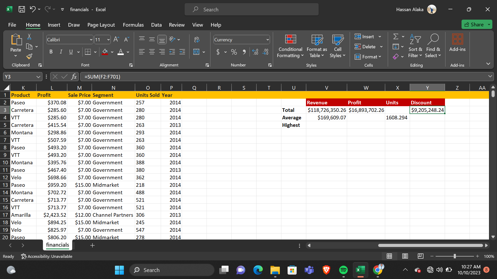

##### What is the number of sales recorded?

This was carried out using the SUM function. The result achieved is shown in the image below. 

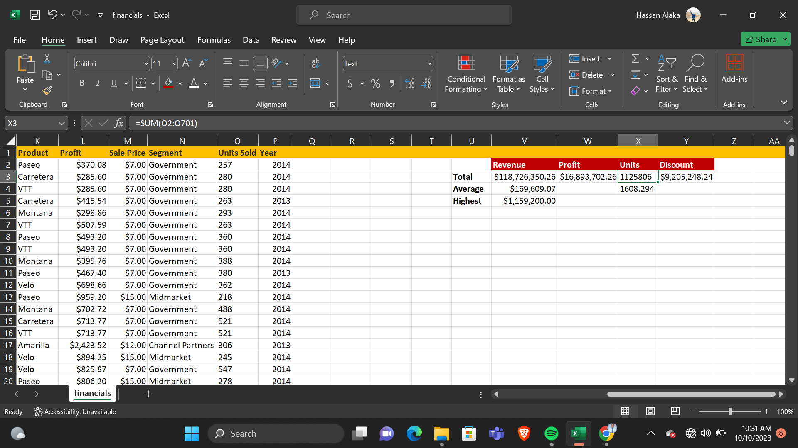

##### What is the highest profit generated? 

This was carried out using the MAX function. The result achieved is shown below. 

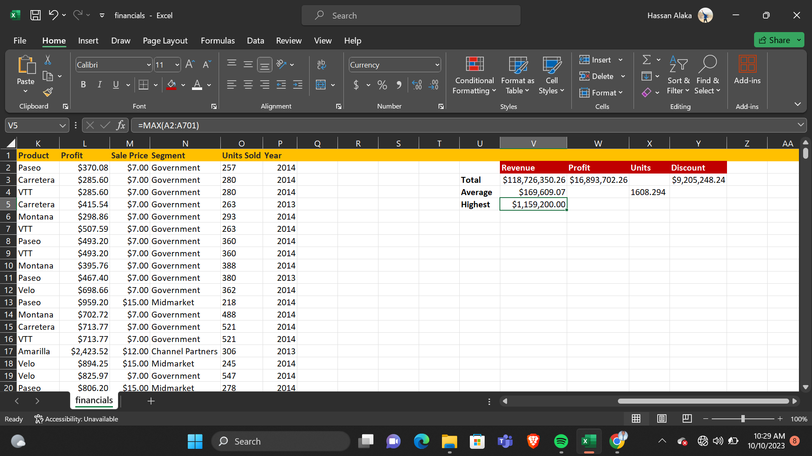

##### Create a column for Sales Range to determine if sales are high or low? 

The sales range was developed using the IF function. The achieved result is shown below. 

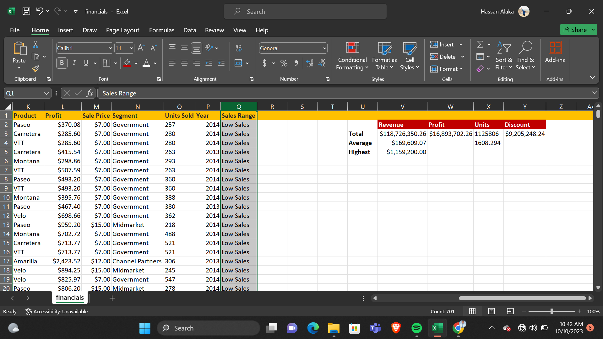

#### Conclusion 

Through this analysis, I was able to understand and get insights into the company employees' details and revenue generated over the years. 

